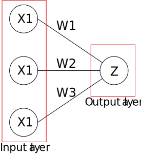

# Problem
This code can find application for several problems.
Specifically, here is an example of a prediction of whether a visitor in a store will buy a computer or not.
# Dataset
For easier understanding, it would be best to make a review of the data set.
Suppose the seller is able to collect information about age, income and visitor's status of employment. Keeping records, a certain period of time, whether a visitor has purchased a computer or not, creates the necessary data set.<br>The income is grouped in three levels:
* low -> 0
* medium -> 0.5
* high -> 1

The status of employment and the information whether the visitor has purchased the item is represented by two states:
* 0 <- not employed / not purchased item
* 1 <- employed / purchased item

|ages|income|employed|buy_computer|
|----|------|--------|------------|
|18  |0     |0       |1           |
|18  |0     |0       |0           |
|19  |0.5   |0       |1           |
|20  |0.5   |1       |0           |
|24  |0     |0       |0           |
|25  |1     |1       |1           |
|26  |0.5   |1       |0           |
|29  |1     |1       |1           |
|32  |0.5   |1       |0           |
|33  |1     |0       |0           |

# How this script makes predictions?
By creating a simple neural network and using this data set, it is possible to predict if there is a possibility that a visitor might purchase a particular product.
### Neural Network
For this project, a single neuron with three input parameters and one output was used.
<p align="center"> 

</p><br>In our output we have the values in the form of 1 and 0. We want our output to be in the same format. To do so we need an activation function, which squashes input values between 1 and 0.

Mathematically, the sigmoid function can be represented as:

$$θ = {1 \over 1 + e^{-Z}}$$

Where Z represents the sum of all products of the input (X) and the weight (W).

$$Z = \sum_{i=1}^{n} Xi \cdot Wi + b$$

### Commenting a code
In this script, some of the basic modules in the Python programming language were used, and these are numpy, pandas, time, and csv.

The sigmoid function has already been mentioned. The method that calculates the derivative of the sigmoid function is defined as sigmoidDerivation.
<br>The derivative of sigmoid function is simply

$$Z' = Z \cdot (1 - Z)$$


```python
def sigmoid(x):  
    return 1/(1+np.exp(-x))
def sigmoidDerivation(x):  
return sigmoid(x)*(1-sigmoid(x))
```

By loading and pre-processing the data set, a list of customer decisions is separated.


```python
file_load = pd.read_csv("data.csv")
customerDecisions = list(file_load['buy_computer'])
rows = csv.reader(open('data.csv'))
setOfSamples = list(rows)[1:]
for i in setOfSamples:
    del i[-1]
    for j in range(len(i)):
i[j] = float(i[j])
```

In the code below, feature set are created. It contains records from the dataset. Also set of labels is created, which contains corresponding labels for each record in the feature set. The labels are the answers we're trying to predict with the neural network.


```python
arrayOfSamples = np.array(setOfSamples)  
labels = np.array([customerDecisions])  
labels = labels.reshape(len(customerDecisions),1)
```

By entering the parameters of the visitor, a list variable is created. For elements (parameters) of this variable, the seller wants to find out whether there is a possibility that a visitor might buy a computer or not.


```python
visitor_info = [float(input('Please enter a value for {}: '.format(i))) for i in ['age', 'income', 'employed']]
```

Since we have three features in the input, we have a vector of three weights. These weights will use some random values. As with the weight, the bias will be assigned a random value.


```python
np.random.seed(50)  
weights = np.random.rand(3,1)
bias = np.random.rand(1)  
learningRate = 0.05 
iteration = 20000
```

The algorithm will have 20000 iterations, with the aim of better training, over a set of data.

As previously mentioned, Z represents the sum of all products of the input (X) and the weight (W). As X is actually a 2D array and a W vector, using a dot operation, a new 2D array is obtained that corresponds to the previous statement. By passing Z values through a sigmoid function, the feed forward ends.

The error or deviation of the received output from the desired is calculated as the difference between the obtained and the desired output value.
Here "d_pred" is simply the sigmoid function and we have differentiated it with respect to input dot product "s".
Then, the s_delta variable is created, which contains the product of error and dpred_ds. Instead of looping through each record and multiplying the input with corresponding z_delta, the input variable matrix is transposed and multiply it with the s_delta. Finally, the learning rate variable with the derivative is multiplied to increase the speed of convergence.


```python
for epoch in range(iteration):  
    inputs = arrayOfSamples

    # Feedforward
    Z = np.dot(arrayOfSamples, weights) + bias
    s = sigmoid(Z)

    # Backpropagation
    error = s - labels
    dpred_ds = sigmoidDerivation(s)

    s_delta = error * dpred_ds

    inputs = arrayOfSamples.T
    weights -= learningRate * np.dot(inputs, s_delta)

    for num in s_delta:
        bias -= learningRate * num
```

Based on a sufficient number of iterations, that is, when the error is reduced to an acceptable value, it is possible to make a prediction for the desired instance


```python
instance = np.array(visitor_info)  
result = sigmoid(np.dot(instance, weights) + bias)  

if result >= 0.5:
    print('\nThere is a possibility that the visitor will buy a computer.')
else:
    print('\nThe chance that the visitor will buy a computer is small.')
```
